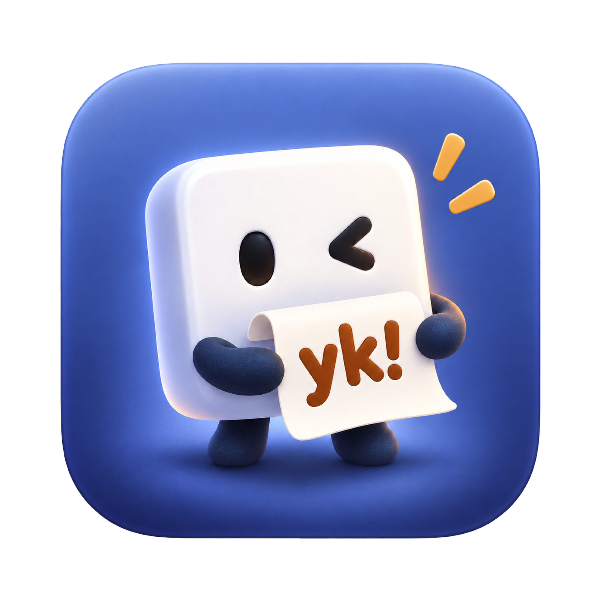

<p align="center">
  
</p>

<h1 align="center">yo!nk</h1>

<p align="center">
  Tiny floating squares for the text you paste all the time.<br>
  Hover to read. Click to copy. Everything stays on your Mac.
</p>

---

## What it is

yo!nk is a small native macOS menu-bar app. Each saved snippet lives in its own floating square with a one- or two-character label. Squares stay above your other windows, on any display you like.

- **Hover** a square to see the full text beside it, with line breaks kept.
- **Click** it to copy the complete text to the clipboard, then paste with ⌘V wherever you want.

yo!nk only copies. It never runs, pastes, or opens anything, so a snippet that looks like a Terminal command is still just text.

## Features

- One independent, translucent floating square per snippet, with a label of one or two letters, numbers, symbols, or emoji
- A hover preview of the complete snippet; very long snippets wrap and end with "… N more lines"
- Click to copy, with a short sound plus your choice of a checkmark, a burst, or no visual change
- Drag squares anywhere, across multiple displays; positions are remembered and restored
- Lock positions to stop accidental drags (hover and copy keep working)
- Adjustable square size (40–160 pt) and opacity (30–100%)
- Per-square global keyboard shortcuts, with no Accessibility permission needed
- Hide/Show All Squares (⌃⌥H) and Snap to Grid (⌃⌥G), both changeable
- A right-click menu on each square: Edit…, Duplicate, Delete, Lock/Unlock Positions, Hide/Show this square, Hide All Squares
- Undo and redo (⌘Z / ⇧⌘Z) for edits, moves, settings, and Snap to Grid
- A Settings window with search, snippet history, and a launch-at-login switch

## Requirements

- macOS 14 Sonoma or later
- To build it: Xcode 27 with Swift 6.4 (Apple Silicon)

## Build and run

From the repository root:

```sh
zsh yoink/scripts/build-app.zsh
```

This makes a Release build and writes `dist/yo!nk.app`, signed ad hoc so it runs on your own Mac. Developer ID signing and notarization for distribution are separate, manual steps.

> **Note:** the app name contains `!`, so quote the path in the shell: `open 'dist/yo!nk.app'`.

The app runs from the menu bar. Choose **Settings…** from its icon to add and edit squares. It shows a Dock icon only while Settings is open.

### Trying it without touching your real data

By default yo!nk keeps its data in `~/Library/Application Support/com.dweebzxx.yoink/`. For development or testing, point it at another folder:

```sh
open -n 'dist/yo!nk.app' --args --config-dir "$PWD/yoink/.build/smoke-config"
```

`YOINK_CONFIG_DIR=/some/folder` works too. Only one running copy can use a given folder at a time.

## Tests

```sh
swift test --package-path yoink
```

Covers the product logic without launching the app. Writes only to `yoink/.build/test-tmp/`.

## Project layout

```text
yoink/
├── Package.swift
├── Sources/
│   ├── YoinkCore/        # product state, rules, persistence, undo, grid, history (Foundation only)
│   └── yoink/            # AppKit app: squares, previews, menu bar, hotkeys
│       └── Settings/     # SwiftUI Settings window, hosted by AppKit
├── Tests/YoinkCoreTests/ # Swift Testing suites and JSON fixtures
└── scripts/build-app.zsh # builds dist/yo!nk.app
assets/                   # app icon, square art, menu-bar icon, sound
```

## Privacy

- All squares, snippets, history, and settings are stored in one local file on your Mac. Only your user account can read it.
- No accounts, no sync, no network, no analytics.
- Snippet history holds only texts you saved in yo!nk, never anything else from your clipboard. You can remove entries or clear it in Settings.

## Credits

© 2026 dweebzxx
