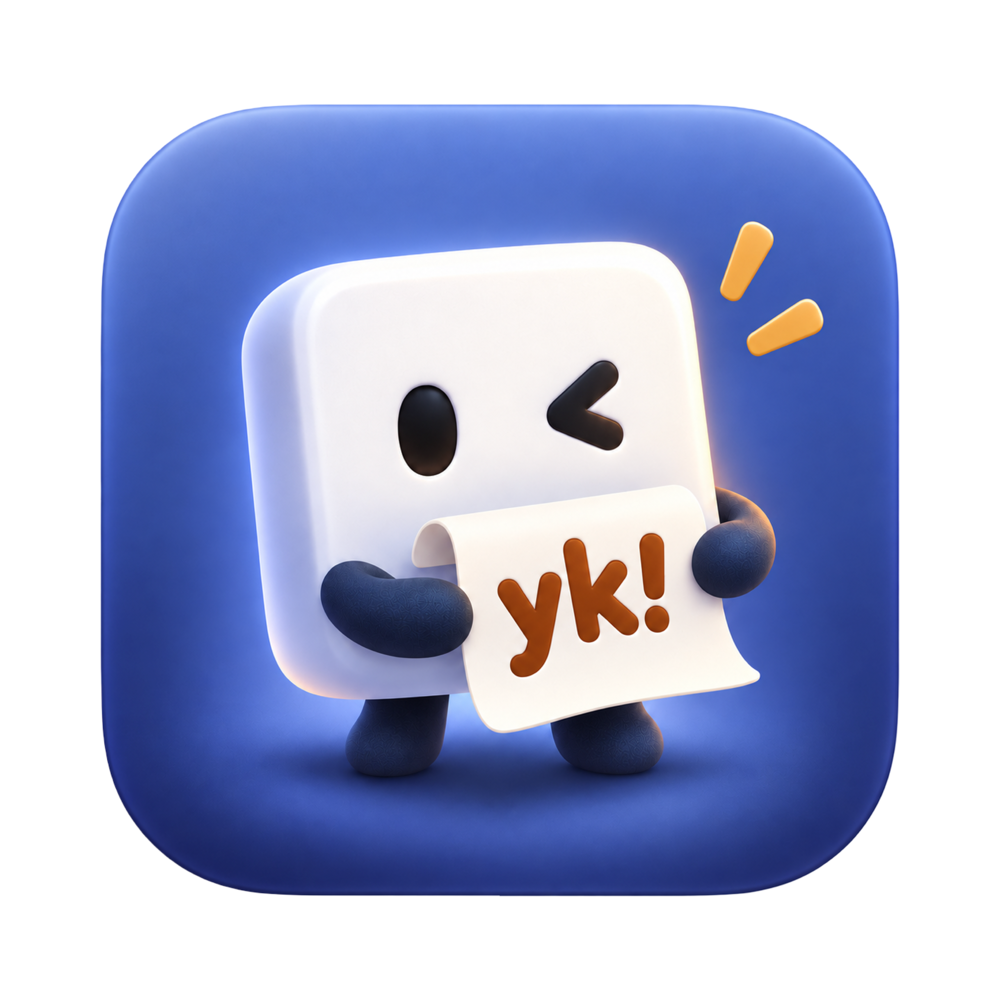

<p align="center">
  
</p>

<h1 align="center">yo!nk</h1>

<p align="center">
  <b>Tiny adorable floating buddies for the text you paste all the time.</b><br>
  Hover to read. Click to copy. Yoink!
</p>

<p align="center">
  
  
  
  
</p>

---

## Meet your new buddies

yo!nk is a small native macOS menu-bar app. Every snippet gets its very own little floating square, and they hang out above your other windows on whichever display you like.

- **Hover** a buddy to read the whole snippet beside it, line breaks and all.
- **Click** it to copy the complete text, then paste with ⌘V wherever you want.

That's it. That's the whole trick. yo!nk only copies. It never runs, pastes, or opens anything, so a snippet that looks like a Terminal command is still just text. (Your buddies are very well behaved.)

## What they can do

- **Squares, not a window.** One translucent floating buddy per snippet. No title bar, no chrome, no big panel hogging your screen.
- **Tiny labels.** Give each one a name of one to four letters, numbers, symbols, or emoji. Three characters or fewer sit on one line, and a four-character label stacks up as two rows of two, so `ABCD` becomes `AB` over `CD`.
- **Hover preview.** The complete text, line breaks kept. Very long snippets wrap and end with "… N more lines".
- **Happy little feedback.** Every copy gets a short sound and your pick of a checkmark, a burst, or no visual change at all.
- **Go for a walk.** Drag them anywhere, across multiple displays. They even wander along with you while you drag, and they remember where you left them. Lock them in place if you'd rather they stay put.
- **Your size, your see-through.** Buddies start at a tidy 40 pt, and you can go from 30 to 160 pt. Opacity runs from 30 to 100%.
- **Shortcuts for each one.** Give any buddy its own global keyboard shortcut. No Accessibility permission needed.
- **Nap time.** Hide/Show All (⌃⌥H) sends everyone away and brings them back. Snap to Grid (⌃⌥G) lines them all up. Both shortcuts are changeable.
- **Camera shy?** Turn off **Show in screenshots** and your buddies stay on your screen but sneak out of screenshots and screen recordings. It's on by default. (It relies on macOS, so a capture tool that does its own thing may ignore it.)
- **A right-click menu** on every buddy: Edit…, Duplicate, Delete, Lock/Unlock Positions, Hide this square, Hide All Squares.
- **Undo and redo** (⌘Z / ⇧⌘Z) for edits, moves, settings, and Snap to Grid. Everyone fat-fingers a drag sometimes.
- **A proper Settings window** with search, snippet history, and a launch-at-login switch.

## Status

Early days! yo!nk is at version 0.2.0, which means initial development: things can still change.

**Download it:** grab the zip from the [Releases page](https://github.com/dweebzxx/yoink/releases) (it's a pre-release), unzip it, and put `yo!nk.app` wherever you like. It's signed ad hoc rather than notarized, so macOS may block the first launch. If it does, open System Settings, go to Privacy & Security, and choose **Open Anyway**.

**Or build it yourself:** it takes one command (see below).

## Requirements

- macOS 14 Sonoma or later
- To build it: Xcode 27 with Swift 6.4 (Apple Silicon)

## Build and run

From the repository root:

```sh
zsh yoink/scripts/build-app.zsh
```

This makes a Release build and writes `dist/yo!nk.app`, signed ad hoc so it runs on your own Mac. Developer ID signing and notarization for distribution are separate, manual steps.

> **Heads up:** the app's name contains a `!`, so quote the path in your shell: `open 'dist/yo!nk.app'`.

yo!nk lives in your menu bar. Choose **Settings…** from its icon to add and edit your buddies. You'll only see a Dock icon while Settings is open.

### Trying it without touching your real data

By default, yo!nk keeps its data in `~/Library/Application Support/com.dweebzxx.yoink/`. For development or testing, point it at another folder:

```sh
open -n 'dist/yo!nk.app' --args --config-dir "$PWD/yoink/.build/smoke-config"
```

`YOINK_CONFIG_DIR=/some/folder` works too. Only one running copy can use a given folder at a time.

## Tests

```sh
swift test --package-path yoink
```

Covers the product logic without launching the app. Writes only to `yoink/.build/test-tmp/`.

## Project layout

```text
yoink/
├── Package.swift
├── Sources/
│   ├── YoinkCore/        # product state, rules, persistence, undo, grid, history (Foundation only)
│   └── yoink/            # AppKit app: squares, previews, menu bar, hotkeys
│       └── Settings/     # SwiftUI Settings window, hosted by AppKit
├── Tests/YoinkCoreTests/ # Swift Testing suites and JSON fixtures
└── scripts/build-app.zsh # builds dist/yo!nk.app
assets/                   # app icon, square art, menu-bar icon, sound
```

## Privacy

Your buddies keep your secrets. Your text stays on your Mac.

- Squares, snippets, history, and settings live in one local file that only your user account can read.
- No accounts, no sync, no network, no analytics.
- Snippet history holds only texts you saved in yo!nk, never anything else from your clipboard. Remove entries or clear it any time in Settings.

## Credits

© 2026 dweebzxx. Released under the [MIT License](LICENSE).
